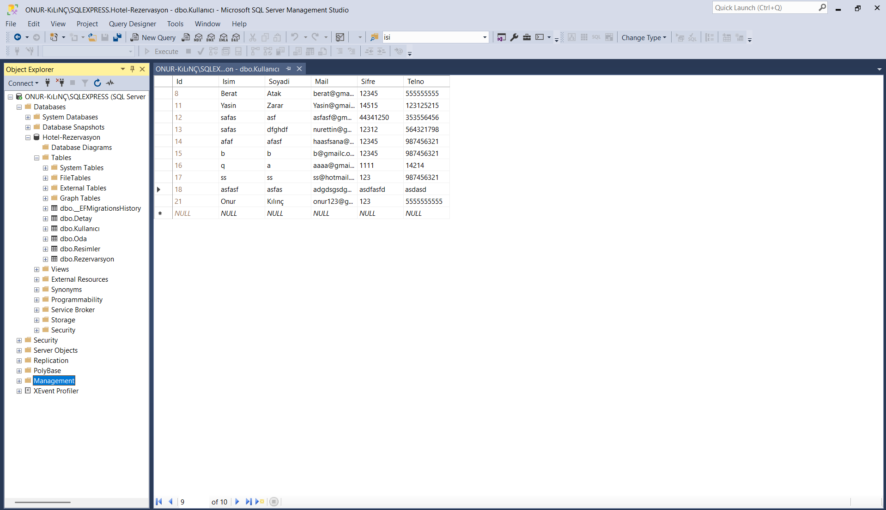
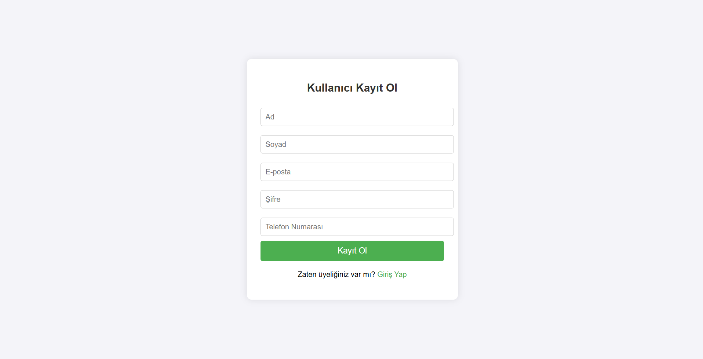
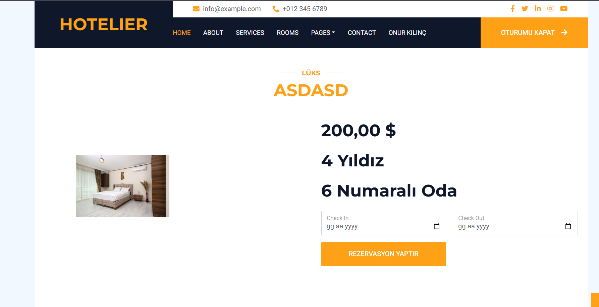
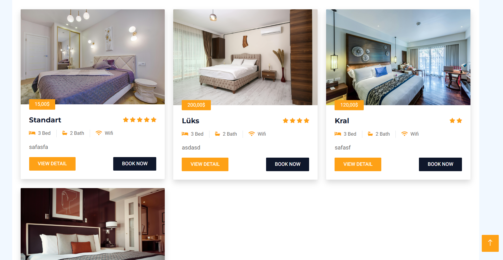
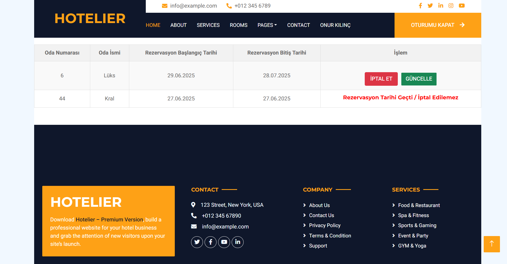

# 🏨 Otel Rezervasyon Sistemi - ASP.NET MVC Projesi

Bu proje, bir otel sitesi için geliştirilmiş rezervasyon sistemidir. Kullanıcılar kayıt olabilir, giriş yapabilir, odaları inceleyip rezervasyon oluşturabilir. Kayıtlı kullanıcılar profil sayfalarında geçmiş rezervasyonlarını görebilir ve CRUD işlemleri gerçekleştirebilir.

## 🚀 Özellikler

- Kullanıcı Kaydı ve Girişi
- Rezervasyon Oluşturma
- Kullanıcı Profil Sayfası
- Rezervasyon Geçmişi Görüntüleme (CRUD)
- Entity Framework & SQL Server bağlantısı
- MVC Mimarisi

## 🧰 Teknolojiler

- ASP.NET MVC
- Entity Framework
- SQL Server
- HTML / CSS / Bootstrap

## 📸 Ekran Görüntüleri

### Ana Sayfa

### Veritabanı

### Güncelleme

### Login

### Oda Detay

### Odalar

### Onay Mesajı

### Profil

## 🧑‍💻 Geliştirici

**Onur Kılınç**
